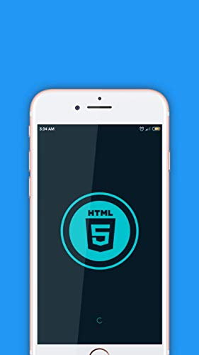
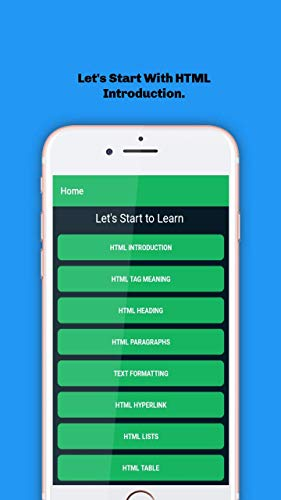
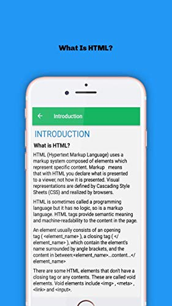

# HTML-Learn-App
This is the New application. I have create using react native framework. 

<h1>HTML Learn App</h1>

	
	<h2>This App Will Start HTML Basic to Advance level. Please Download and try learn Today.</h2>

<h3>Description:</h3>
  Learn HTML which is today most in-demand language on your mobile phone for free.
That's journey Learn HTML programming or to become an HTML developer expert.
Build your HTML skills on the go with amazing free application to learn HTML.This amazing HTML programming Learning app has amazing content such as HTML Tutorial, HTML Programming Lessons.
This Application can be used by anyone want you a student. in This application in briefly explain.

<h3>App ScreenShort::</h3>
	
  

<h3>Features:</h3>
<li>Intuitive UI.</li>
  <li>App is easy to Navigate for everybody.</li>
  <li>Pocket size</li>
  <li>App is of tiny size and doesn't take much storage space even in low-end devices.</li>
  <li>Easy to Use for beginners</li>

<h2><a href="https://www.amazon.com/dp/B08MB2J2D9/ref=apps_sf_sta">GET THIS APP</a></h2>

NOTE: This application are available  only Amazon App store.
	

